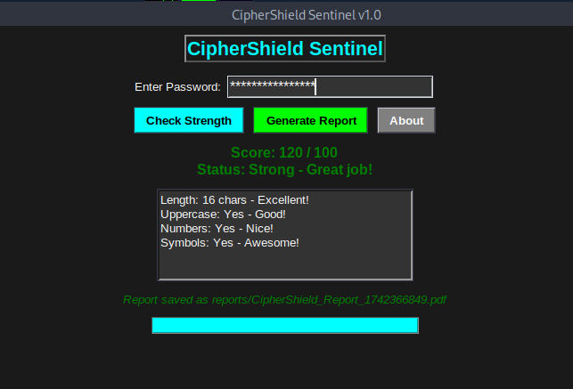

# CipherShield Sentinel 

A cybersecurity tool combining password strength checking and sandbox simulation.

## Features
- Scores passwords (length, complexity).
- Simulates brute-force with a progress bar.
- PDF reports with tips.
- GUI with splash screen.

## Usage
- Setup: `python3 -m venv venv; source venv/bin/activate; pip3 install reportlab`
- Run: `python3 gui.py`
- Enter a password, click "Check Strength," then "Generate Report."

## Outputs

### GUI Output ("SecureP@ssw0rd!2025")

### Sample Report
[Download Report](sample_report.pdf)

## Files
- `gui.py`: Main app.
- `sandbox.py`: Sandbox logic.

## Author
Nirpesh, March 2025
